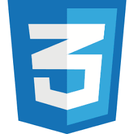
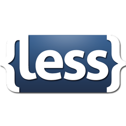

#                   **FRON-PROYECTO**



---

Para el front de este proyecto se utilizó el framework Svelte, y Node.js para la validación de usuarios y el envío del token necesario para el acceso al dashboard.

## Comandos


### Servidor Node.js + Token

```bash
mkdir jwt-auth-server
cd jwt-auth-server

npm init -y
npm insatall stack
npm isntall cors
npm install express jsonwebtoken body-parser dotenv

# Para ejecutar el servidor
node server.js
```

### Frontend Svelte (TypeScript + JavaScript + HTML + CSS)

```bash
curl -o- https://raw.githubusercontent.com/nvm-sh/nvm/v0.39.3/install.sh | bash

export NVM_DIR="$HOME/.nvm"
[ -s "$NVM_DIR/nvm.sh" ] && \. "$NVM_DIR/nvm.sh"  # Esto carga nvm
[ -s "$NVM_DIR/bash_completion" ] && \. "$NVM_DIR/bash_completion"  # Esto carga la finalización de bash para nvm

nvm --version

nvm install --lts

nvm use --lts

node -v

npm init vite primer-svelte --template svelte
cd primer-svelte
npm install

npm install -D less

# Para iniciar el frontend
npm run dev
```

## Credenciales de Login

- Usuario: `testuser`
- Contraseña: `password123`

(Si las credenciales no son correctas, no se podrá acceder al dashboard.)

## Información

Las credenciales se pueden cambiar desde el servidor Node.js. Se crea un solo usuario según la petición del usuario:

```js
const user = {
  id: 1,
  username: 'testuser',
  password: 'password123'
};
```

---

